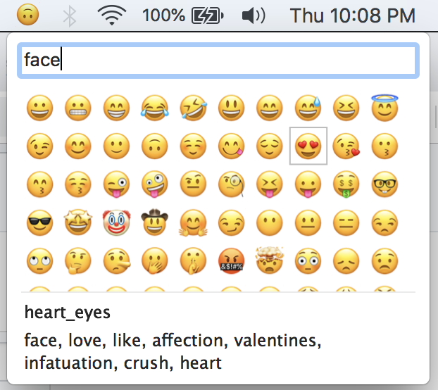
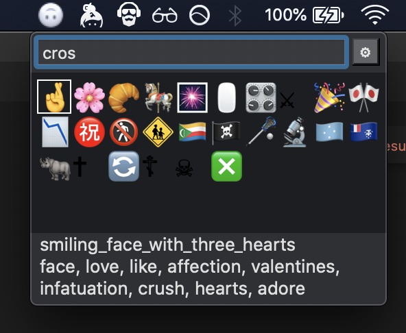

# Qmoji
A lightning fast emoji picker for macos, written in swift

Features
- [x] dark mode support
- [x] shows up instantly (no slow animation)
- [x] customizable shortcut
- [x] fuzzy matching on emoji name & keywords
- [x] remembers most frequently used emojis
- [x] option to display at mouse cursor
- [x] tiny disk size (under 3mb)
- [x] easy on the ram (under 50mb)

## Troubleshooting

After upgrading (or rebuilding locally), be sure to go to Security & Privacy > Privacy > Accessibility and re-authorize qmoji! uncheck & check the box, otherwise it won't be able to send characters to other applications.

Inspired by the excellent [mojibar](https://github.com/muan/mojibar).

## Installation

- go to [the releases page](https://github.com/jaredly/qmoji/releases)
- download `qmoji.zip` & unzip it
- right-click qmoji.app & select "open" (because it's not signed, double-clicking won't work the first time)
- you should see a 🙃 in your statusbar
- if you want to use the default shortcut (cmd+opt+space), you'll need to disable the macos "show a finder search window" shortcut like so https://twitter.com/ThomasAlcala/status/1088710623708565504
- go forth and emoji ⚡ 🏎

## Controls

Keyboard:
- trigger with option-cmd-space
- tab & shift-tab or arrow keys to move the selection
- enter to use the current emoji (it types it into the topmost application for you)
- escape to clear the search text, or if it's empty then it closes the window

Mouse:
- click an emoji to select it
- right-click an emoji to remove from "recently used" list

## Contributing

- Xcode, it should build & run without any issues (no third-party libraries used)
