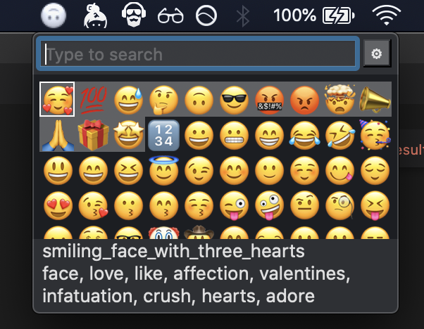

Ok folks, here it is. The source code is still living over in the [fluid repo](https://github.com/jaredly/fluid/tree/master/src/qmoji), because I'm using it to field test the Fluid api & macos bindings. But I made this separate repositories so that releases will make sense. Also I'll probably move the source code over here eventually.

Inspired by the excellent [mojibar](https://github.com/muan/mojibar).

that's what I'm talkin bout

definitely saving on the ram side of things too

## Why make this?
I'm making a [react-like UI framework for native reasonml](https://github.com/jaredly/fluid) & I wanted to try cloning a simple electron-based app as a proof of concept. [joakin suggested mojibar](https://twitter.com/joakin/status/1084898563082125312), and so here we are. It turned out to be more of a stress test than I was expecting (rendering 1500 views turned out to be prohibitively expensive, so I ended up exploring the wonderful world of `drawRect:` & custom NSViews), but I'm pretty happy with how it's turned out.

## Future work
that I'll probably do because I already like this better than mac's builtin picker

- [ ] memory of most-frequently used
- [ ] fuzzy search
- [ ] option to start at login
- [ ] skin tone modifier selection
- [ ] more perf optimization for click / hover state (I currently invalidate the whole view when you click, which is hugely wasteful)
- [ ] customize the global shortcut (maybe, idk)

## Supported platforms

This is macos only, and I don't really expect to port it to windows or linux -- the menubar stuff & the "send a keypress to the next active window" seems quite platform-specific. I am planning on making fluid cross-platform though (it currently supports js & native macos).
